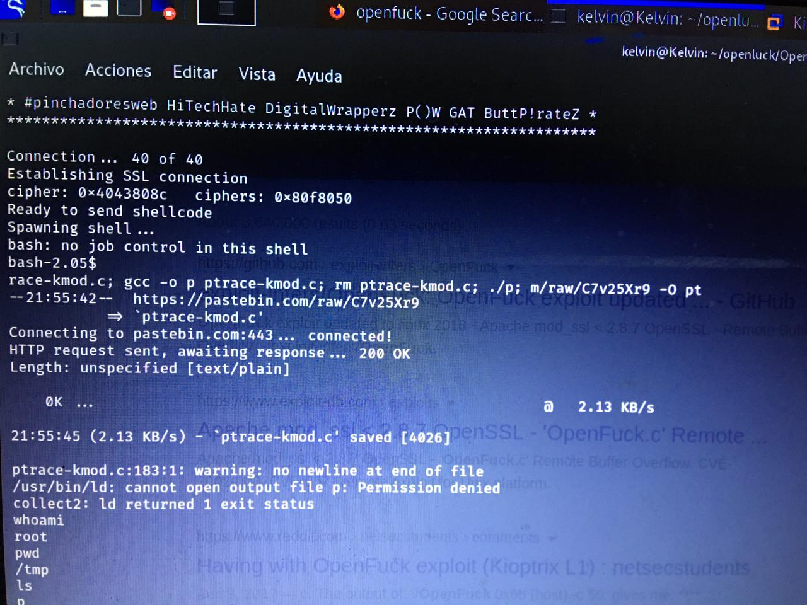

# REPORTE DE VULNERABILIDADES EN KIOPTRIX
# NOMBRE DE LAS VULNERABILIDADES EXPLOTADAS
Vulneración al protocolo SMB, Ataque con OPENLUCK

# CONTENIDO:
Contenido y descripción del reporte: 

El objetivo del ataque es lograr vulnerar nuestra maquina en este caso KIOPTRIX lv.1 , para ello arrancamos nuestra maquina kioptrix en un red local, en nuestra primera fase del ataque tenemos la siguiente metodología de hacking 
1.	Vulneración a prtocolo SMB
Vulnerabilidad en Samba permite el control total de los equipos,Una vulnerabilidad de ejecución remota de código de 7 años de antigüedad fue descubierta en el software de red Samba que podría permitir a un atacante remoto tomar el control de las máquinas atacadas

# APLICATIVO O SISTEMA VULNERABLE
Maquina VIrtual Kioptrix Lv.

# REPRODUCCIÓN
1. Hacer un barrido a la red para identificar los host 
2. Encontrar el servicio a explotar y detalles de la version : msfconsole
3. search/smb 
4. Ejecutar el módulo smb_version con el comando:use auxiliar / scanner / smb / smb_version
5. una  vez obtenida  la versión del protocolo SMB , procedemos a obtener y establecer la conexión  con el protocolo
6. Explotar y enumerar vulnerabilidades en nuestra prueba de penetración
7.  Acceder a la consola de metasploit en el modulo trans2Open
8.  Ejecutar el MOdulo trans2open
9.  comprometer la maquina con los datos obtenidos atraves del módulo

# IMPACTO
Poder penetrar las vulnerabilidades encontradas, a traves del escalamiento de privilegios para asi poder comprometer los datos del aplicativo tales como: Usuarios, contraeñas, base de datos, correos electronicos...

# MITIGACIÓN

aplicar el parche de seguridad que corrige la vulnerabilidad, tanto en los dispositivos cliente, como en el servidor para evitar que posibles atacantes puedan hacer uso de la misma

Los administradores de Samba ya han arreglado el problema en sus nuevas versiones Samba 4.6.4/4.5.10/4.4.14

# PoC

# REFERENCIAS:

-	https://github.com/heltonWernik/OpenLuck
-	https://vold3m0rt.medium.com/kioptrix-level-1-285e1ae90162

