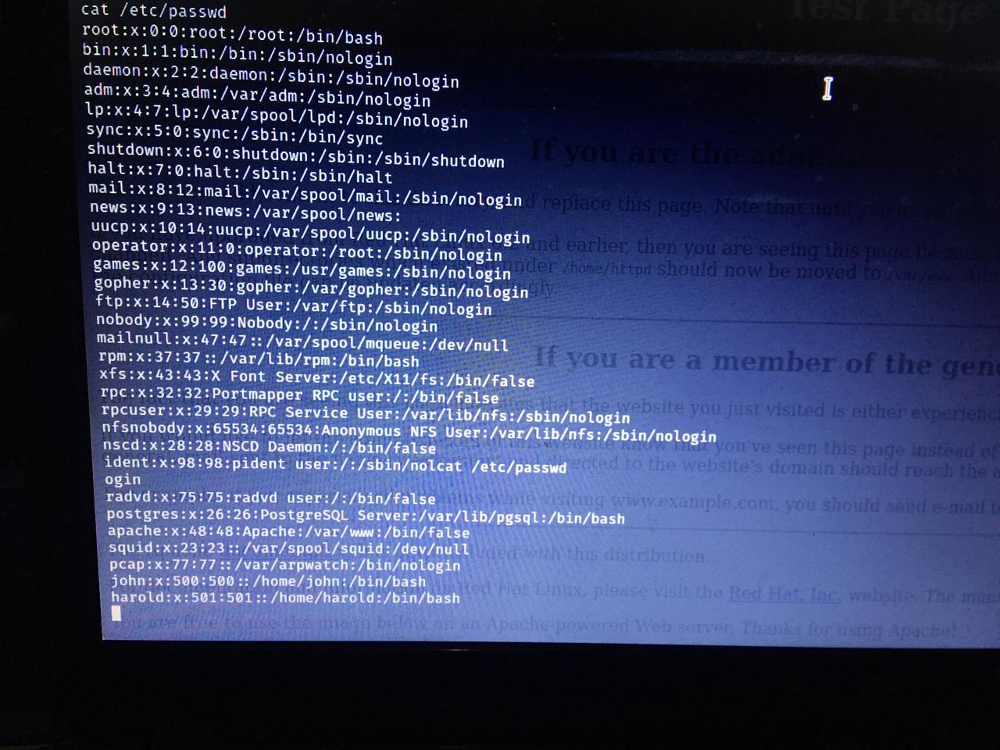
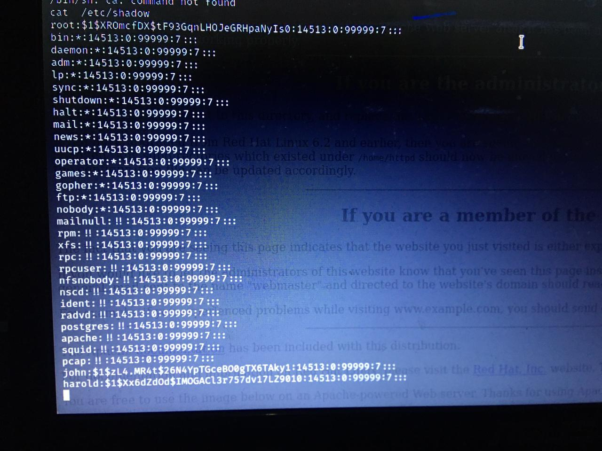
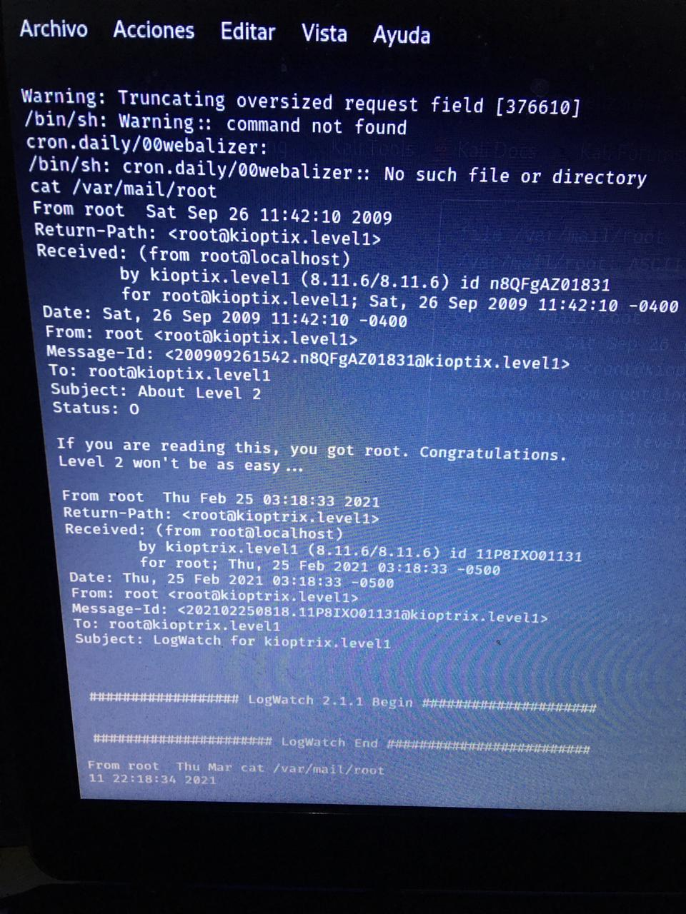

# REPORTE DE VULNERABILIDADES EN KIOPTRIX
# NOMBRE DE LAS VULNERABILIDADES EXPLOTADAS
Vulneración al protocolo SMB, Ataque con OPENLUCK

# CONTENIDO:
Contenido y descripción del reporte: 

El objetivo del ataque es lograr vulnerar nuestra maquina en este caso KIOPTRIX lv.1 , para ello arrancamos nuestra maquina kioptrix en un red local, en nuestra primera fase del ataque tenemos la siguiente metodología de hacking 
1.	Vulneración a prtocolo SMB
Vulnerabilidad en Samba permite el control total de los equipos,Una vulnerabilidad de ejecución remota de código de 7 años de antigüedad fue descubierta en el software de red Samba que podría permitir a un atacante remoto tomar el control de las máquinas atacadas

# APLICATIVO O SISTEMA VULNERABLE
Maquina VIrtual Kioptrix Lv.

# REPRODUCCIÓN
1. Hacer un barrido a la red para identificar los host 
2. Encontrar el servicio a explotar y detalles de la version : msfconsole
3. search/smb 
4. Ejecutar el módulo smb_version con el comando:use auxiliar / scanner / smb / smb_version
5. una  vez obtenida  la versión del protocolo SMB , procedemos a obtener y establecer la conexión  con el protocolo
6. Explotar y enumerar vulnerabilidades en nuestra prueba de penetración
7.  Acceder a la consola de metasploit en el modulo trans2Open
8.  Ejecutar el MOdulo trans2open
9.  comprometer la maquina con los datos obtenidos atraves del módulo

# IMPACTO
Poder penetrar las vulnerabilidades encontradas, a traves del escalamiento de privilegios para asi poder comprometer los datos del aplicativo tales como: Usuarios, contraeñas, base de datos, correos electronicos...

# MITIGACIÓN

aplicar el parche de seguridad que corrige la vulnerabilidad, tanto en los dispositivos cliente, como en el servidor para evitar que posibles atacantes puedan hacer uso de la misma

Los administradores de Samba ya han arreglado el problema en sus nuevas versiones Samba 4.6.4/4.5.10/4.4.14

# PoC

# REFERENCIAS:

-	https://github.com/heltonWernik/OpenLuck
-	https://vold3m0rt.medium.com/kioptrix-level-1-285e1ae90162

English Version

# NAME OF THE VULNERABILITIES EXPLOITED
Violation of the SMB protocol, Attack with OPENLUCK

# CONTENTS:
Report content and description:

The objective of the attack is to manage to violate our machine in this case KIOPTRIX lv.1, for this we start our kioptrix machine in a local network, in our first phase of the attack we have the following hacking methodology

SMB protocol vulnerability Vulnerability in Samba allows full control of computers, A 7-year-old remote code execution vulnerability was discovered in Samba network software that could allow a remote attacker to take control of the attacked machines
APPLICATION OR VULNERABLE SYSTEM
Kioptrix VIrtual Machine Lv.

# REPRODUCTION
Sweep the network to identify the hosts
Find the service to exploit and version details: msfconsole
search / smb
Run the smb_version module with the command: use auxiliary / scanner / smb / smb_version
once the version of the SMB protocol is obtained, we proceed to obtain and establish the connection with the protocol
Exploit and list vulnerabilities in our penetration test
Access the metasploit console in the trans2Open module
Run the trans2open module
commit the machine with the data obtained through the module

# IMPACT
Being able to penetrate the vulnerabilities found, through the escalation of privileges in order to compromise the application data such as: Users, passwords, database, emails ...

# MITIGATION
apply the security patch that corrects the vulnerability, both on client devices and on the server to prevent possible attackers from using it

Samba administrators have already fixed the problem in their new Samba 4.6.4 / 4.5.10 / 4.4.14 versions

# REFERENCE

- https://github.com/heltonWernik/OpenLuck
-	https://vold3m0rt.medium.com/kioptrix-level-1-285e1ae90162

